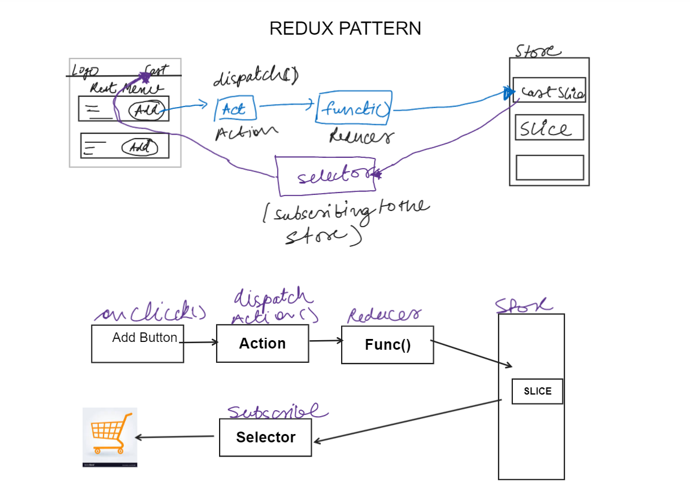

# namasteReact

## Day - 1

- Learned how to add react directly to html
- Learned on how to use `React.CreateElement` in 2 different ways consisting of childrens and sibling elements

```
const parent= React.createElement(
"div",
{id:"parent"},
    React.createElement(
        "div",
        {id:"child"},
       [ React.createElement("h1",{},"Nested H1 Tag"),
       React.createElement("h4",{},"I am a H2 tag")
    ]

    )
)

const heading= React.createElement("h1",{id:"heading"},"Hello World");

```

- Transitive dependencies-> `Dependencies of package on package`
- added parcel

## Day - 2

- Run App using Parcel- npx parcel index.html
- Added BrowserList
- React.createElement => ReactElement - which is a JS Object =>Rendered as HTML Element
- JSX is TRanspilled to JS Using-> PARCEL which uses-> Babel
- BABEL transpiles to React.createElement => ReactElement - which is a JS Object =>Rendered as HTML Element

`Usage of JSX`

```
    const heading=(<h1 className="heading">We Are up using JSX </h1>);

    //(closing brackets)=>required when we have to add multi line JSX

    const root= ReactDOM.createRoot(document.getElementById('root'));
    root.render(heading)
```

## Day 3

- Learned How to write functional Components and how using JSX we can excute Js inside functional component

`Different ways of writting Functional Components`

### Way 1

```
 const Comp=()=>{
        return <h1> Pass this arrow Func</h1>
    }
```

### Way 2

```
const Title=()=>(
    <h1 className="heading">
        We Are up using JSX
    </h1>
);
```

- Learned component Composition and how to render react component

```
const HeadingComponent= ()=>(
    <div id="container">
        {/* {console.log(5+'5')} -> this is correct we cna writ js using {} */}
        {heading}
    <Title/>

        <h1 className="heading">Functional Component 🚀</h1>

    </div>
)
```

`Rendering React Component`

```
// root.render(heading) --> we render React element  Like this
root.render(<HeadingComponent/>) // We render React component like this
```

#### Inline styles

- give style as js object

```
const styleC={
    color: black;
}
<h1 style={styleC}>Check Me</h1>
<h1 style={{color: black;}}>Check Me</h1>

```

- both above ways are correct but not preferd to write inline css

## working with Props 🐱‍🚀

- Passing prop to a component is same as passing args to Function
- So props is used to pass data across component

`Syntax`

```
{resObj.map(data => (
 <RestaurantCard key={data.info.id} resInfo={data.info} />
))}

```

- in this code resInfo is a prop

```
`consuming Prop`

const RestaurantCard=(props)=>{
   const {resInfo}=props

   // destructuring data from props
   const {avgRating,
          areaName,
          cloudinaryImageId,
          costForTwo,
          cuisines,
          isOpen,
          name

         }=resInfo

  return(
            <div className="res-card">
                
               <div className="res-card-header">
                    <h3>{name}</h3>
                    <h5>{avgRating}⭐</h5>

               </div>
                <h4>{costForTwo}</h4>
                <h5>{cuisines.join(", ")}</h5>

            </div>
    )
}

```

> [!IMPORTANT]
> It is important to pass key when we rendera component in a loop because if won't react will rerender the component

## Day 4

> **React Hooks** 🚀

1. **useState**

   - useState hook is a utility function which help us to keep our Data Layer and UI Layer Synchronized

   `in simple JS`

   ```
   let ResList=[]; // we Declare or intialise like this

   // to update it we do
   ResList=['abc'] or ResList.push(abc)

   ```

   - this above way will update data but our ui wont get updated

   `in React `

   ```
   const [resList, setResList]= useState(resObj); // => use usestate to declare array and setReslist to update it whenever needed

   const Body=()=>{

       const [resList, setResList]= useState(resObj);

       // const filterRes=()=>{
       //    return setResList( resObj.filter((data)=>{
       //       if(data.info.avgRating>4){
       //         return <RestaurantCard key={data.info.id} resInfo={data.info} ></RestaurantCard>
       //       }
       //     }))
       // }  ==> This also works correctly

       const filterRes = () => {
           const topRated = resObj.filter(data => data.info.avgRating > 4);
           setResList(topRated); // Update state with filtered restaurants
       }
       return(
           <div className="body">
               <div className="search">Search</div>
               <button onClick={()=>{filterRes()}} className="filter-btn">Top 🌟 Restaurants</button>
               <div className="res-container">

               {resList.map(data => (
                       <RestaurantCard key={data.info.id} resInfo={data.info} />
                   ))}

               </div>
           </div>
       )
   }

   ```

   > [!IMPORTANT]
   > React's Reconciliation Process

   React's reconciliation is the process by which React updates the DOM. This is crucial for React to efficiently handle changes in the application's state and props and update the UI accordingly.

   ### 1. Virtual DOM

   React maintains a virtual representation of the DOM, known as the **Virtual DOM**. When a change occurs in a component's state or props, React creates a new Virtual DOM tree.

   ### 2. Diffing

   React then compares this new Virtual DOM tree with the previous one in a process called **diffing**. Through this comparison, React determines what has changed between the two trees.

   ### 3. Minimal Updates

   After the diffing process, React identifies the changes and instead of re-rendering the entire application, it **updates only the segments** of the real DOM that have changed. This ensures React's efficiency.

   ### 4. Component Lifecycle

   During reconciliation, React adheres to the **component lifecycle**. Methods like `shouldComponentUpdate` can be used to optimize and possibly skip parts of the reconciliation process if we determine a component hasn't changed.

   ### 5. Keys

   When rendering a list of elements from an array, React uses the `key` prop to uniquely identify each element. This helps React in preserving and reusing DOM nodes correctly during the reconciliation process. It's essential to provide a `key` prop when mapping over an array to generate JSX.

   ### 6. Algorithm

   The reconciliation algorithm is efficient, standing at `O(n)`, where `n` is the number of elements in the tree. This allows React to be incredibly fast and efficient.

   > **Note:** It's essential to differentiate between reconciliation and rendering. Rendering is the process by which React creates the new Virtual DOM tree. Reconciliation, on the other hand, involves comparing this new tree with the previous one and making the necessary DOM updates.

2. **useEffect 🚀**

   - useEffect is used to render a API cal when our Bsic UI is rendered
   - useEffect() hook accepts 2 arguments:

     `useEffect(callback[, dependencies]);`

     - callback is a function that contains the side-effect logic. callback is executed right after the DOM update.
     - dependencies is an optional array of dependencies. useEffect() executes callback only if the dependencies have changed between renderings.
     - Put your side-effect logic into the callback function, then use the dependencies argument to control when you want the side-effect to run. That's the sole purpose of useEffect().

- implemented filter and search functionality using useState

```
  const searchFilter = () => {
    const srchedRes = resList.filter((data) => {
      return data.info.name.toLowerCase().includes(srchText.toLowerCase());
    });
    console.log("Filtered Results:", srchedRes);

    srchedRes.length > 0
      ? setFltrdList(srchedRes)
      : alert("no Restaurant found");
  };

```

## Day 5

1.  **useEffect** (continued..):

    - if no dependancy array is present => useEffect is called on every render
    - if dependency array is empty [] => useEffect is called on intial render (just once)
    - if dependency array has any dependency=> it will only be called evertime deppendency component is updated

      ```
      useEffect(() => {
      fetchData();
      }, [btnComponent]);

      ```

## Server-side vs Client-side Routing

| Feature/Aspect    | Server-side Routing                                                               | Client-side Routing                                                                                          |
| ----------------- | --------------------------------------------------------------------------------- | ------------------------------------------------------------------------------------------------------------ |
| **How it works**  | Every request goes to the server for a full page refresh.                         | After initial load, page transitions are handled by JavaScript without full page reloads.                    |
| **Advantages**    | - Better for SEO<br>- Initial page loads can be faster for first-time visitors.   | - Faster subsequent page transitions after initial load<br>- Enhanced user experiences like animations.      |
| **Disadvantages** | - Slower subsequent page transitions<br>- More server resources for each request. | - Slower initial page load due to larger bundle size<br>- Potential SEO challenges if not handled correctly. |
| **Examples**      | PHP, ASP.NET, Ruby on Rails, Django                                               | React (with React Router), Angular, Vue.js                                                                   |

2. Routing In React using React-Router-Dom - React Router Dom Gives lots of easy way to handle routing - We can easily declare child Route, Parent Route and Error Route like this Using `CreateBrowserRoute()`

   ```
   const appRouter = createBrowserRouter([
   {
    path: "/",
    element: <AppLayout />,
    children: [
      {
        path: "/",
        element: <Body />,
      },
      {
        path: "/about",
        element: <About />,
      },
      {
        path: "/contact",
        element: <Contact />,
      },
      {
        path: "/restaurant/:id",
        element: <RestaurantMenu />,
      },
    ],
    errorElement: <Error />,
   },
   ]);
   ```

   - Rather then using Hrf or Anchor tag we should use `<Link>` tag for passing routes-> it supports SPA

   ```
     <div className="nav-items">
        <ul>
          <li>
            <Link to="/"> Home</Link>
          </li>
          <li>
            <Link to="/about">About Us</Link>
          </li>
          <li>
            <Link to="/contact">Contact Us</Link>
          </li>
          <li>Cart</li>
        </ul>
      </div>

   ```

   - useParams Hook is used to pass dynamic params to route

   ```
   <Link key={data.info.id} to={"restaurant/" + data.info.id}>
            <RestaurantCard resInfo={data.info} />
          </Link>

   ```

   `Consuming Param`

   ```
   const { id } = useParams();

   ```

## Day 6

> ** Class Bsed Component 🚀**

1.  `Creating a class based component`

        ```
            import  { Component } from 'react';

            class MyClassComponent extends Component {
            render() {
                return <div>My Class Component</div>;
            }
            }

            export default MyClassComponent;

        ```

    Certainly! Here's a well-structured `README.md` for both the topics:

---

````
# React Class Components: Props and Constructors

## Table of Contents

- [Props in React Class Components](#props-in-react-class-components)
- [Using Constructors in React Class Components](#using-constructors-in-react-class-components)

## Props in React Class Components

Props (short for "properties") in React allow components to pass and receive data from each other. They are immutable and help components to be more dynamic and reusable.

### Basic Usage:

```javascript
class Welcome extends React.Component {
  render() {
    return <h1>Hello, {this.props.name}</h1>;
  }
}

// Using the component:
<Welcome name="React" />
````

### Detailed Explanation:

1. **Passing Props**: You can pass props to a component when using it:

   ```javascript
   <Welcome name="React" />
   ```

2. **Accessing Props**: Inside the class component, you can access the passed props via `this.props`.

3. **Props are Immutable**: Once passed into a component, props cannot be modified inside the receiving component.

## Using Constructors in React Class Components

### What is a constructor?

A constructor is a special method used for creating and initializing an object. In React, the constructor for a class component initializes state and binds event handler methods.

### Why and when to use constructors?

1. **Initializing State**: If your component has state that isn't derived from props, you'll initialize it in the constructor.

   ```javascript
   constructor(props) {
     super(props);
     this.state = {
       count: 0
     };
   }
   ```

2. **Binding Event Handlers**: If you're using methods that need to access `this` and aren't using arrow functions, you'll need to bind them in the constructor.

3. **Passing Props to the Super Class**: Ensure `this.props` is set before any other statements are executed by passing `props` to the super class.

### When can you skip the constructor?

1. **State Initialization**: With the class fields proposal, you can initialize state outside the constructor.
2. **Arrow Functions**: If you use arrow functions for your methods, you don't need to bind them in the constructor.
3. **Functional Components**: With the introduction of hooks, functional components can now handle state, reducing the need for class components.

---

**Note**: While constructors play an important role in React class components, newer features and patterns have reduced the need for them. However, understanding constructors and their use cases remains crucial in certain projects.

```

---

You can use the above markdown code in your `README.md`. When rendered on platforms like GitHub, it will appear well-structured and formatted.
```

2. Understanding Seting state a and calling API's and Lifecycle functions in CBC
   https://drive.google.com/file/d/1feiOyAHjkXmTwaOOL0GsTTGK6sXChD2d/view?pli=1

## Day 7

1.  **Custom Hooks**

- Custom hooks are nothing just a simple funtion which helps in keeping our app modular and follow Single Responsibility Principle

`useOnlineStatus() Custom Hook`

```
  import { useEffect, useState } from "react";

  const useOnlineStatus = () => {
    //   try check if online
    const [onlineStatus, setOnlineStatus] = useState(true);
    useEffect(() => {
      window.addEventListener("offline", () => {
        setOnlineStatus(false);
      });

      window.addEventListener("online", () => {
        setOnlineStatus(true);
      });
    }, []);

    return onlineStatus;
  };

  export default useOnlineStatus;

```

`Usage`

```
const onlineStatus = useOnlineStatus();

```

2. **Lazy Loading/ Chunking 💔**

`Syntax`

```
  // import Like this
  const Grocery = lazy(() => import("./component/Grocery"));

  // Use Like this
   {
      path: "/grocery",
      element: (
        <Suspense fallback={<h1>Loading...</h1>}>
          <Grocery />
        </Suspense>
      ),
    },

```

- Fallbacks can be a component or just a tag it is used because React is too fast and if we Don't use Suspense and Fallback it will not be able to load are lazy component.

## Day 8

1. **Higher Order Component**

   - these are component which take a component do some enhancements and return a component
   - but we do not change anything in our original component

`MAKING a HOC`

```
 export const withPromotedLabel = (RestaurantCard) => {
   return (props) => {
     return (
       <div>
         <label className="bg-green-200 rounded-lg absolute ms-5 italic mt-2 p-2">
           Open
         </label>
         <RestaurantCard {...props} />
       </div>
     );
   };
 };

```

`Consuming HOC`

```
 const PromotedCard = withPromotedLabel(RestaurantCard);

```

## Day 9 (cont,,-> Day 8)

2. **Controlled and Uncontrolled Components**

   - Basicalyy controlled an uncontrolled components is sort of Hypothetical concept Which explains behaviour of Components
     Certainly! Here's a `README.md` that explains the concepts of Controlled and Uncontrolled Components, using the provided files as examples.

   ## Controlled vs Uncontrolled Components in React

   In React, components can either manage their own state (uncontrolled) or have their state managed by a parent component (controlled). This README uses the `RestaurantMenu` and `RestaurantCategory` components as examples to explain these concepts.

   ### 1. Controlled Components

   A controlled component does not maintain its own local state for specific props or values. Instead, it derives its value from the parent component. It's "controlled" by the parent.

   **Example**: The `RestaurantCategory` component in our provided files.

   ```javascript
   const RestaurantCategory = (props) => {
     const { categoryData, accordionState, setIndex } = props;

     const handleClick = () => {
       setIndex();
     };

     return (
       <div onClick={handleClick}>
         <span>{categoryData.title}</span>
         {accordionState && <ItemList items={categoryData.itemCards} />}
       </div>
     );
   };
   ```

   Here, the `accordionState` prop determines whether the category is expanded or not. When a category is clicked, the `setIndex` function (also passed as a prop) is called, and the state changes are managed by the parent `RestaurantMenu` component.

   ### 2. Uncontrolled Components

   An uncontrolled component maintains its own local state and is not directly influenced by its parent component.

   In our files, there's a commented-out line in the `RestaurantCategory` component, which hints at a potential uncontrolled approach:

   ```javascript
   // const [accordionState, setAccordionState] = useState(false);
   ```

   If this line were active, the `RestaurantCategory` would be using its local state to determine its expanded/collapsed state, making it uncontrolled in this aspect.

   ### How `RestaurantMenu` Controls `RestaurantCategory`

   In the `RestaurantMenu` component:

   ```javascript
   {
     categories.map((category, index) => (
       <RestaurantCategory
         key={category?.card?.card.title}
         categoryData={category?.card?.card}
         accordionState={index === showIndex ? true : false}
         setIndex={() => setShowIndex(index)}
       />
     ));
   }
   ```

   The `showIndex` state of `RestaurantMenu` determines which category (if any) is currently expanded. The `setIndex` function updates this state, effectively controlling the `accordionState` of each `RestaurantCategory`.

   ***

   This approach, where the parent component manages the state and passes it down to child components, is a common pattern in React and is often favored for its predictability and consistency.

   ***

3. **Lifting State Up in React**

   "Lifting state up" refers to the practice of placing shared state in a common ancestor component. This allows multiple components to share and manipulate the state, ensuring consistent behavior and data flow.

   Using the provided `RestaurantMenu` and `RestaurantCategory` components, let's explore this concept.

   ### Overview

   In our example:

   - `RestaurantCategory`: Represents an individual category with items. It can be in an expanded or collapsed state.
   - `RestaurantMenu`: Lists multiple `RestaurantCategory` components and manages which category is expanded.

   ### Lifting the State Up - A Deep Dive

   1. **Local State (Initial Approach)**

   Originally, the `RestaurantCategory` could have had its own local state to determine if it's expanded or collapsed:

   ```javascript
   // const [accordionState, setAccordionState] = useState(false);
   ```

   With this approach, each category would manage its expansion state independently.

   2. **Shared Behavior (The Need to Lift State)**

   However, for better user experience, we might want only one category to be expanded at a time. This requires a shared state across all categories, which is a perfect scenario for lifting the state up.

   3. **Lifting the State to `RestaurantMenu`**

   The `RestaurantMenu` component now manages the `showIndex` state, which determines which category is expanded:

   ```javascript
   const [showIndex, setShowIndex] = useState(0);
   ```

   This state is then passed down to each `RestaurantCategory` as a prop:

   ```javascript
   {
     categories.map((category, index) => (
       <RestaurantCategory
         key={category?.card?.card.title}
         categoryData={category?.card?.card}
         accordionState={index === showIndex ? true : false}
         setIndex={() => setShowIndex(index)}
       />
     ));
   }
   ```

   By clicking on a category, the `setIndex` function updates the `showIndex`, which in turn updates the `accordionState` for each category.

   ### Benefits

   - **Consistency**: By centralizing the state, you ensure that all components that depend on it are consistent in behavior and data.
   - **Simplified Data Flow**: Data flows in a single, clear direction, making debugging and data tracking easier.

4. **Context API**

   - Context API is used to remove the problem of passing props from parent to child component which have to many components in between or Issue of Prop Drilling
   - In Context API we maintain a Global State and we can update it or get state dat in any component where needed

   `Creating Context using createContext`

   ```
   import { createContext } from "react";

   const UserContext = createContext({
     // default value
     loggedInUser: "default",
   });

   export default UserContext;

   ```

   `Consuming Context using useContext Hook`

   ```
   const loggedUserContext = useContext(UserContext);

   ```

   `Consuming Inside Class Based Component`

   ```
     <div>
          loggedInUser
          <UserContext.Consumer>
            {({ loggedInUser }) => <h1>{loggedInUser}</h1>}
          </UserContext.Consumer>
        </div>
   ```

   `Updating Value of Context (.Provider)`

   ```
   // this wiil give updated value only on all components
   // loggedInUser -> is our global state of context getting updated by userName  which is a state variable

   <UserContext.Provider value={{ loggedInUser: userName, setUserName }}>
       <div className="app">
         <Header />
         <Outlet />
       </div>
     </UserContext.Provider>

   ```

   ```
   // this wiil give updated value only on  header
   <div className="app">
   <UserContext.Provider value={{ loggedInUser: userName, setUserName }}>
     <Header />
   </UserContext.Provider>

     <Outlet />
   </div>
   ```

   `Dynamically Updating Value of context `

   - so basically we are accesing the useState varaibles which we passed from our Provie -> (UserContext.Provider) and using setUserName() we can update it as any state variable

   ```
   const { loggedInUser, setUserName } = useContext(UserContext);

    <div className="search m-4 p-4 flex items-center">
          <label>UserName : </label>
          <input
            className="border border-black p-2"
            value={loggedInUser}
            onChange={(e) => setUserName(e.target.value)}
          />
        </div>
   ```

   ## React's Context API & Lifting State Up: A Deeper Dive

React's Context API and the practice of Lifting State Up are advanced techniques that facilitate efficient data sharing and state management in applications, especially as they grow in complexity.

### 1. Why the Context API?

In larger React applications, passing data between components (especially those far apart in the component tree) becomes cumbersome. This is often referred to as "prop drilling", where data is passed through many components that don't necessarily need it, just so it reaches a component deep down in the tree. Context API offers a solution by allowing data to be shared across components without explicit prop passing.

### 2. Creating & Initializing Context:

Before you can provide or consume context, you need to create it. This is done using the `createContext` function. The value you pass to `createContext` will be the default value for the context.

```javascript
import { createContext } from "react";
const UserContext = createContext({
  loggedInUser: "default",
});
```

### 3. Providing Context:

Once the context is created, the next step is to provide it to the components that need it. This is done using the `Provider` component that comes with every Context object.

In our example, the `AppLayout` component in `app.js` acts as the context provider:

```javascript
<UserContext.Provider value={{ loggedInUser: userName, setUserName }}>
  // ... child components go here ...
</UserContext.Provider>
```

The `value` prop on the `Provider` is what will be accessible to any nested component that consumes this context.

### 4. Consuming Context:

Components nested inside a `Provider` can access the context value without it being passed explicitly as a prop. The `useContext` hook provides a way to tap into this value:

```javascript
const { loggedInUser, setUserName } = useContext(UserContext);
```

### 5. Lifting State Up:

When you have multiple components that need to share and modify the same data, it's often beneficial to move that state to their nearest common ancestor. This practice is known as "Lifting State Up".

In our case, the `userName` state is managed in the `AppLayout` component (`app.js`), even though it's the `Body` component (`Body.js`) that uses and modifies it. By lifting the state up to `AppLayout`, it can be easily shared with any other component using the Context API.

### 6. Benefits of Lifting State Up with Context API:

- **Single Source of Truth**: Centralizes the state management, reducing inconsistencies and bugs.
- **Avoid Prop Drilling**: Data can be shared across the component tree without having to pass it down through intermediate components.
- **Encapsulation**: Components can be more self-contained, not having to rely on props passed from multiple levels up.

### 7. Considerations:

While the Context API provides a powerful tool for state management, it's essential to use it judiciously:

- **Overhead**: It might be an overkill for simple state management tasks. Local component state or simple prop passing might suffice.
- **Re-renders**: Remember that consuming components will re-render when the context value changes, which can have performance implications.
- **Use with Other Patterns**: Context API can be effectively combined with other patterns and libraries, like reducers (with `useReducer`) or state management libraries like Redux.

## Day 10


